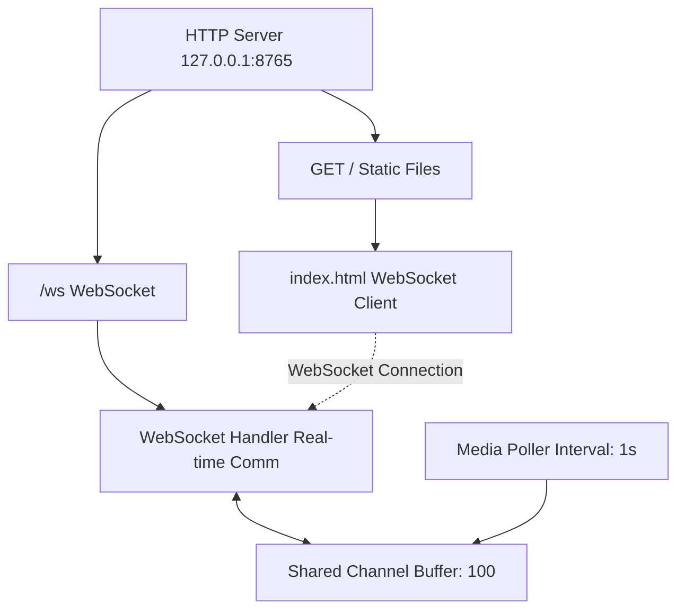
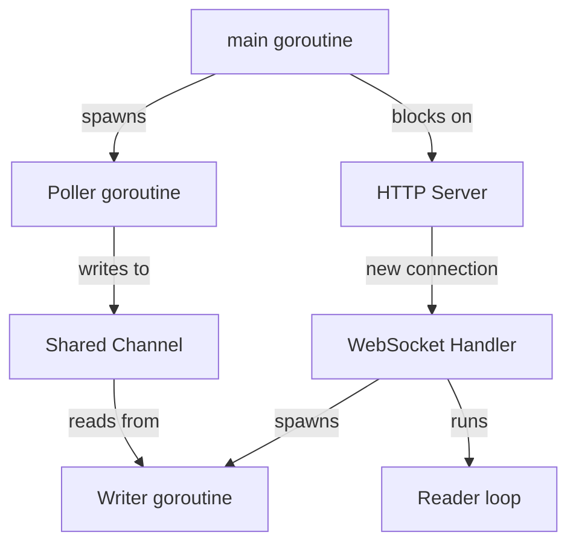

import { Callout } from "nextra/components";
import { Steps } from "nextra/components";
import { Tabs } from "nextra/components";

# 🚀 Main Application Documentation

<Callout type="info">
  `main.go` is the entry point of the Blitz server application. It initializes
  the HTTP server, sets up routes, and starts the media poller goroutine.
</Callout>

---

## 📦 Package Information

| Property         | Value                                                                     |
| ---------------- | ------------------------------------------------------------------------- |
| **Package**      | `main`                                                                    |
| **File**         | `main.go`                                                                 |
| **Dependencies** | `Blitz/utils/poller`, `Blitz/utils/websocket`, `github.com/joho/godotenv` |

---

## 🔧 Functions

### `main()`

<Callout type="default">
  **Description**: Entry point of the application. Initializes the server and
  starts all services.
</Callout>

<Steps>

### Load Environment Variables

Loads environment variables from `.env` file using `godotenv.Load()`

### Setup HTTP Routes

Registers `/ws` for WebSocket and `/` for static files

### Start Media Poller

Launches poller in a goroutine with `go poller.Handle()`

### Start HTTP Server

Blocks on `http.ListenAndServe()` at configured address

</Steps>

**Environment Variables**:

| Variable          | Description         | Default     |
| ----------------- | ------------------- | ----------- |
| `LOCAL_HOST_IP`   | Server bind address | `127.0.0.1` |
| `LOCAL_HOST_PORT` | Server port         | `8765`      |

<Tabs items={['Go Code', 'Explanation']}>
  <Tabs.Tab>
```go
func main() {
    // Load .env file
    if err := godotenv.Load(); err != nil {
        log.Println("Warning: .env file not found, using system environment variables")
    }

    // Setup routes
    http.HandleFunc("/ws", websocket.Handle)
    http.HandleFunc("/", serveHome)

    // Start poller
    go poller.Handle()

    // Start server
    localAddr := os.Getenv("LOCAL_HOST_IP") + ":" + os.Getenv("LOCAL_HOST_PORT")
    if err := http.ListenAndServe(localAddr, nil); err != nil {
        log.Fatal("Server error:", err)
    }

}

````
  </Tabs.Tab>
  <Tabs.Tab>
**Flow Explanation**:
1. **godotenv.Load()** - Reads `.env` file and sets environment variables
2. **http.HandleFunc()** - Registers HTTP handlers for routes
3. **go poller.Handle()** - Starts background goroutine for media polling
4. **http.ListenAndServe()** - Blocks and starts accepting HTTP connections
  </Tabs.Tab>
</Tabs>

<Callout type="warning" emoji="⚠️">
**Error Handling**: If `.env` file is missing, logs warning but continues with system environment variables. If server fails to start, application exits with fatal error.
</Callout>

---

### `serveHome(w http.ResponseWriter, r *http.Request)`

<Callout type="default">
**Description**: HTTP handler for serving the main web interface.
</Callout>

**Parameters**:

| Parameter | Type | Description |
|-----------|------|-------------|
| `w` | `http.ResponseWriter` | Response writer |
| `r` | `*http.Request` | HTTP request |

**Route Details**:

| Property | Value |
|----------|-------|
| **Path** | `/` |
| **Method** | `GET` only |
| **Serves** | `temp/web/index.html` |

**Response Codes**:

| Code | Status | Condition |
|------|--------|-----------|
| 🟢 `200` | OK | File served successfully |
| 🔴 `404` | Not Found | Path is not `/` |
| 🟡 `405` | Method Not Allowed | Method is not `GET` |

<Tabs items={['Code', 'Security Notes']}>
  <Tabs.Tab>
```go
func serveHome(w http.ResponseWriter, r *http.Request) {
    if r.URL.Path != "/" {
        http.Error(w, "Not found", http.StatusNotFound)
        return
    }
    if r.Method != http.MethodGet {
        http.Error(w, "Method not allowed", http.StatusMethodNotAllowed)
        return
    }
    http.ServeFile(w, r, "temp/web/index.html")
}
````

  </Tabs.Tab>
## 🛣️ Server Routes

| Route | Handler            | Purpose                       | Type           |
| ----- | ------------------ | ----------------------------- | -------------- |
| `/ws` | `websocket.Handle` | WebSocket connection endpoint | 🔌 WebSocket   |
| `/`   | `serveHome`        | WebSocket test client HTML    | 📄 Static File |

### WebSocket Route

- **Path**: `/ws`
- **Handler**: `websocket.Handle`
- **Purpose**: WebSocket connection endpoint for real-time communication

### Web Interface Route

- **Path**: `/`
- **Handler**: `serveHome`
- **Purpose**: Serves the WebSocket test client HTML page

---

## Application Flow

````mermaid
graph TD
    A["main() Start"] --> B["Load .env file"]
    B --> C[Setup Routes]
    C --> D["Register /ws handler"]
    C --> E["Register / handler"]
    D --> F["Start Media Poller"]
    E --> F
    F --> G["Start HTTP Server :8765"]
    G --> H{"Incoming Request?"}
    H -->|WebSocket| I["/ws Handler"]
    H -->|"HTTP GET /"| J["Serve index.html"]
    I --> K["Real-time Communication"]
    J --> L["Web Client Interface"]
```---

## Configuration

### Required Environment Variables

<details>
<summary>📝 Click to expand .env template</summary>

## ⚙️ Configuration

### Required Environment Variables

<Callout type="warning">
  Create a `.env` file in the project root with the following variables:
</Callout>

<Tabs items={['.env File', '.env.example', 'Shell Export']}>
  <Tabs.Tab>
```bash
# Localhost Configuration
LOCAL_HOST_IP=127.0.0.1
LOCAL_HOST_PORT=8765

# Spotify API Configuration (optional)

SPOTIFY_CLIENT_ID=your_client_id
SPOTIFY_CLIENT_SECRET=your_client_secret
SPOTIFY_REDIRECT_URI=http://127.0.0.1:8765/spotify/callback

````

  </Tabs.Tab>
  <Tabs.Tab>
```bash
# Localhost Configuration
LOCAL_HOST_IP=
LOCAL_HOST_PORT=

# Spotify API Configuration

SPOTIFY_CLIENT_ID=
SPOTIFY_CLIENT_SECRET=
SPOTIFY_REDIRECT_URI=

## 🚀 Running the Application

<Tabs items={['Development', 'Production', 'Docker']}>
  <Tabs.Tab>
**Development Mode** (with hot reload)

```bash
# Run directly with go
go run main.go
```

Expected output:

```
Hello Blitz Server ...
Starting server on http://0.0.0.0:8765
WebSocket endpoint: ws://localhost:8765/ws
Press Ctrl+C to stop the server
lo 127.0.0.1:8765
```

  </Tabs.Tab>
  <Tabs.Tab>
**Production Build**

```bash
## 🌐 Accessing the Application

<Callout type="info">
After starting the server, access these endpoints:
</Callout>

| Endpoint | URL | Purpose |
|----------|-----|---------|
| **Web Interface** | [http://127.0.0.1:8765/](http://127.0.0.1:8765/) | WebSocket test client |
| **WebSocket** | `ws://127.0.0.1:8765/ws` | WebSocket connection |

<Tabs items={['Browser', 'cURL', 'wscat']}>
  <Tabs.Tab>
Open in browser:
```

http://127.0.0.1:8765/

````
  </Tabs.Tab>
  <Tabs.Tab>
Test with cURL:
```bash
curl http://127.0.0.1:8765/
````

  </Tabs.Tab>
  <Tabs.Tab>
Connect WebSocket:
```bash
# Install wscat
npm install -g wscat

# Connect

wscat -c ws://127.0.0.1:8765/ws

```
  </Tabs.Tab>
</Tabs>uild image
docker build -t blitz:latest .

# Run container
docker run -p 8765:8765 --env-file .env blitz:latest
```

  </Tabs.Tab>
</Tabs>un with hot reload (requires go installed)
go run main.go
```

### Expected Output

```
Hello Blitz Server ...
Starting server on http://0.0.0.0:8765
WebSocket endpoint: ws://localhost:8765/ws
Press Ctrl+C to stop the server
lo 127.0.0.1:8765
```

---

## Accessing the Application

### Web Interface

Open in browser:

```
http://127.0.0.1:8765/
```

### WebSocket Endpoint

Connect WebSocket client to:

```
ws://127.0.0.1:8765/ws
```

---

## Architecture Overview



---

## 🐛 Error Scenarios

<Callout type="error">Common errors and solutions</Callout>

### .env File Missing

<Tabs items={['Problem', 'Solution']}>
  <Tabs.Tab>
**Behavior**: Logs warning, continues with system env vars

**Impact**: Server may fail to start if vars not set

```

Warning: .env file not found, using system environment variables

```

  </Tabs.Tab>
  <Tabs.Tab>
**Fix**:
```bash
# Create .env file
cp .env.example .env
## ✅ Best Practices

<Callout type="tip" emoji="💡">
  Follow these guidelines for optimal development
</Callout>

### DO ✅

| Practice                                | Reason                   |
| --------------------------------------- | ------------------------ |
| ✅ Set environment variables in `.env`  | Configuration management |
| ✅ Use `go run main.go` for development | Fast iteration           |
| ✅ Build binary for production          | Better performance       |
| ✅ Monitor logs for errors              | Early problem detection  |
| ✅ Use version control (git)            | Track changes            |

### DON'T ❌

| Practice                                      | Risk                           |
| --------------------------------------------- | ------------------------------ | --------- |
| ❌ Commit `.env` file to git                  | Security - exposes credentials |
| ❌ Run as root                                | Security vulnerability         |
| ❌ Expose to public internet without security | Attack surface                 |
| ❌ Hardcode configuration                     | Inflexibility                  | dy in use |

````

  </Tabs.Tab>
  <Tabs.Tab>
**Fix Option 1** - Kill process:
```bash
lsof -ti:8765 | xargs kill -9
```

**Fix Option 2** - Change port:

```bash
# Edit .env
LOCAL_HOST_PORT=8766
```

  </Tabs.Tab>
</Tabs>

### Static File Not Found

<Tabs items={['Problem', 'Solution']}>
  <Tabs.Tab>
**Error**: Browser shows 404 or blank page

**Cause**: `temp/web/index.html` doesn't exist

  </Tabs.Tab>
  <Tabs.Tab>
**Fix**:
```bash
# Ensure file exists
ls -la temp/web/index.html

# Create if missing

mkdir -p temp/web

# ... create index.html

```
  </Tabs.Tab>
</Tabs>

---

## Goroutines



### Media Poller Goroutine

- **Started by**: `go poller.Handle()`
- **Purpose**: Continuously polls media player information
- **Frequency**: Every 1 second
- **Lifecycle**: Runs for entire application lifetime

---

## Error Scenarios

### .env File Missing

- **Behavior**: Logs warning, continues with system env vars
- **Impact**: Server may fail to start if vars not set
- **Solution**: Create `.env` file or set system environment variables

### Port Already in Use

- **Error**: `listen tcp :8765: bind: address already in use`
- **Solution**:
  - Kill process using port: `lsof -ti:8765 | xargs kill -9`
  - Or change `LOCAL_HOST_PORT` in `.env`

### Static File Not Found

- **Error**: Browser shows 404 or blank page
- **Cause**: `temp/web/index.html` doesn't exist
- **Solution**: Ensure `temp/web/index.html` file exists

---

## Best Practices

### DO ✅

- Always set environment variables in `.env` file
- Use `go run main.go` for development
- Build binary for production deployment
- Monitor logs for errors

### DON'T ❌

- Don't commit `.env` file to git (use `.env.example`)
- Don't run as root (security risk)
- Don't expose server to public internet without security measures
- Don't hardcode configuration values

---

## Dependencies

### External Packages

```go
import "github.com/joho/godotenv"  // Environment variable loading
```

### Internal Packages

```go
import (
    "Blitz/utils/poller"      // Media polling
    "Blitz/utils/websocket"   // WebSocket handling
)
```

---

## Future Improvements

- [ ] Add graceful shutdown handling (SIGINT/SIGTERM)
- [ ] Add HTTPS support with TLS certificates
- [ ] Add middleware for logging, CORS, authentication
- [ ] Add health check endpoint (`/health`)
- [ ] Add metrics endpoint (`/metrics`)
- [ ] Add configuration validation on startup
- [ ] Add ability to reload configuration without restart

---

## Related Documentation

- [Poller Documentation](./POLLER.md)
- [WebSocket Documentation](./WEBSOCKET.md)
- [Project Structure](../PROJECT_STRUCTURE.md)
- [Spotify Integration](../SPOTIFY_README.md)

---

**Last Updated**: November 14, 2025
**Version**: 1.0.0
````
