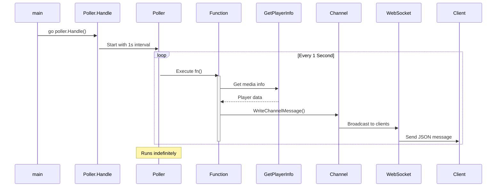
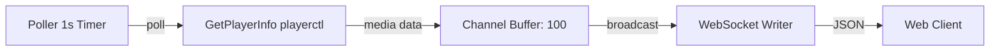

# Poller Package Documentation

## Overview

The `poller` package provides generic polling utilities for executing functions at regular intervals, with a specific implementation for polling media player information.

---

## Package Information

- **Package**: `poller`
- **Location**: `utils/poller/`
- **Purpose**: Periodic task execution with graceful shutdown
- **Dependencies**:
  - `Blitz/models` - Data structures
  - `Blitz/utils` - Media info utilities
  - `Blitz/utils/websocket` - Channel communication

---

## Files

### 1. `poller.go` - Generic Poller

Generic polling function that can be reused for any periodic task.

#### Function: `Poller(interval time.Duration, quit <-chan struct{}, fn func())`

**Description**: Executes a function repeatedly at specified intervals until quit signal received.

**Parameters**:

- `interval time.Duration` - Time between function executions
- `quit <-chan struct{}` - Channel for graceful shutdown signal
- `fn func()` - Function to execute periodically

**Behavior**:

1. Executes `fn()` immediately on start
2. Creates ticker with specified interval
3. Executes `fn()` every interval
4. Stops when quit channel receives signal
5. Cleans up ticker resources

**Example Usage**:

```go
quit := make(chan struct{})

// Start poller
go Poller(5*time.Second, quit, func() {
    fmt.Println("Task executed")
})

// Stop poller after 30 seconds
time.Sleep(30 * time.Second)
close(quit)
```

**Implementation Details**:

```go
func Poller(interval time.Duration, quit <-chan struct{}, fn func()) {
    ticker := time.NewTicker(interval)
    defer ticker.Stop()

    // Run immediately on start
    fn()

    for {
        select {
        case <-ticker.C:
            fn()
        case <-quit:
            fmt.Println("Poller stopped via quit signal")
            return
        }
    }
}
```

**Key Features**:

- ✅ Immediate execution on start
- ✅ Graceful shutdown via quit channel
- ✅ Automatic ticker cleanup
- ✅ Blocking select prevents busy-waiting
- ✅ No default case (prevents immediate exit)

---

### 2. `handler.go` - Media Poller Implementation

Specific implementation for polling media player information.

#### Function: `Handle()`

**Description**: Starts media info poller that broadcasts updates to WebSocket clients.

**Behavior**:

1. Calls generic `Poller()` with 1-second interval
2. Gets media player info via `utils.GetPlayerInfo()`
3. Broadcasts updates through WebSocket channel
4. Handles errors gracefully

**Execution Flow**:

```
Start → Poll Every 1s → Get Player Info → Send to WebSocket → Repeat
```

**Implementation**:

```go
func Handle() {
    Poller(1*time.Second, make(chan struct{}), func() {
        msg, err := utils.GetPlayerInfo()

        if err != nil {
            fmt.Printf("⚠️ Failed to get player info: %v\n", err)
            return
        }

        websocket.WriteChannelMessage(
            models.ServerResponse{
                Status:  "success",
                Message: "media_info",
                Data:    msg,
            },
        )
    })
}
```

**Frequency**: 1 second (1000ms)

**Output Format**:

```json
{
  "status": "success",
  "message": "media_info",
  "data": {
    "title": "Song Title",
    "artist": "Artist Name",
    "album": "Album Name",
    "status": "playing"
  }
}
```

**Error Handling**:

- Logs error message with ⚠️ emoji
- Continues polling (doesn't crash)
- Skips sending message on error

---

#### Function: `QuiteChan() chan struct{}`

**Description**: Creates a quit channel for stopping the poller.

**Returns**: `chan struct{}` - Unbuffered channel for quit signals

**Usage**:

```go
quit := QuiteChan()

// Start poller with quit channel
go Poller(1*time.Second, quit, func() {
    // Task
})

// Stop poller
close(quit)
```

**Note**: Currently unused in `Handle()` implementation (poller runs indefinitely).

---

## Architecture

### Poller Workflow



### Communication Flow



---

## Usage Examples

### Example 1: Basic Polling

```go
package main

import (
    "Blitz/utils/poller"
    "fmt"
    "time"
)

func main() {
    quit := make(chan struct{})

    go poller.Poller(2*time.Second, quit, func() {
        fmt.Println("Tick:", time.Now())
    })

    time.Sleep(10 * time.Second)
    close(quit)
}
```

### Example 2: Media Info Polling

```go
package main

import (
    "Blitz/utils/poller"
)

func main() {
    // Starts polling media info every 1 second
    poller.Handle()

    // Server runs indefinitely
    select {}
}
```

### Example 3: Custom Interval

```go
quit := make(chan struct{})

// Poll every 5 seconds
go poller.Poller(5*time.Second, quit, func() {
    // Custom task
    updateSystemInfo()
})
```

---

## Integration with WebSocket

### Channel Communication

The poller broadcasts messages through the shared WebSocket channel:

```go
websocket.WriteChannelMessage(
    models.ServerResponse{
        Status:  "success",
        Message: "media_info",
        Data:    playerInfo,
    },
)
```

### Message Flow

1. **Poller** polls media info every 1 second
2. **Channel** receives the message (buffered, capacity 100)
3. **WebSocket Handler** reads from channel
4. **Client** receives real-time updates

---

## Configuration

### Poll Interval

Current: `1 * time.Second`

To change interval, modify `handler.go`:

```go
func Handle() {
    // Change 1*time.Second to desired interval
    Poller(5*time.Second, make(chan struct{}), func() {
        // ...
    })
}
```

### Recommended Intervals

| Use Case          | Interval | Reason             | CPU Impact |
| ----------------- | -------- | ------------------ | ---------- |
| 🎵 Media Player   | 1s       | Real-time feel     | Low        |
| 📊 System Stats   | 5s       | Balanced updates   | Minimal    |
| 🌐 Network Info   | 10s      | Reduce overhead    | Very Low   |
| 🔋 Battery Status | 30s      | Slow-changing data | Negligible |

---

## Error Handling

### Media Info Errors

**Scenario**: `GetPlayerInfo()` fails (no player running)

**Behavior**:

```go
if err != nil {
    fmt.Printf("⚠️ Failed to get player info: %v\n", err)
    return  // Skip this iteration
}
```

**Result**: Poller continues, skips failed iteration

### Channel Errors

**Scenario**: Channel is full (100 messages buffered)

**Behavior**: Message dropped (non-blocking send in `WriteChannelMessage()`)

**Prevention**: Increase channel buffer size or reduce poll frequency

---

## Performance Considerations

### Resource Usage

- **CPU**: Minimal (blocked on ticker most of time)
- **Memory**: ~100 KB (ticker + channel buffer)
- **Goroutines**: 1 per poller instance

### Optimization Tips

1. **Adjust Interval**: Reduce frequency if updates not critical
2. **Channel Buffer**: Increase if messages being dropped
3. **Error Handling**: Add exponential backoff on persistent errors
4. **Conditional Polling**: Only poll when WebSocket clients connected

---

## Lifecycle Management

### Starting Poller

```go
// In main.go
go poller.Handle()
```

**Note**: Currently runs in goroutine for entire application lifetime.

### Stopping Poller

**Current**: No stop mechanism (runs until app exits)

**Recommended**: Implement graceful shutdown:

```go
func Handle() {
    quit := make(chan struct{})

    // Store quit channel somewhere accessible
    GlobalQuitChannel = quit

    Poller(1*time.Second, quit, func() {
        // ...
    })
}

// On shutdown
close(GlobalQuitChannel)
```

---

## Testing

### Unit Test Example

```go
func TestPoller(t *testing.T) {
    quit := make(chan struct{})
    count := 0

    go Poller(100*time.Millisecond, quit, func() {
        count++
    })

    time.Sleep(550 * time.Millisecond)
    close(quit)

    if count < 5 || count > 6 {
        t.Errorf("Expected 5-6 executions, got %d", count)
    }
}
```

---

## Common Issues

### Issue 1: Poller Exits Immediately

**Cause**: `default` case in select statement

**Solution**: Remove default case (already fixed)

```go
// ❌ BAD
select {
case <-ticker.C:
    fn()
case <-quit:
    return
default:
    return  // Causes immediate exit
}

// ✅ GOOD
select {
case <-ticker.C:
    fn()
case <-quit:
    return
}
```

### Issue 2: Messages Not Reaching Clients

**Cause**: Channel full or not being read

**Solution**:

- Check WebSocket handler is reading channel
- Increase channel buffer size
- Reduce poll frequency

### Issue 3: Memory Leak

**Cause**: Ticker not stopped

**Solution**: Always defer ticker.Stop()

```go
ticker := time.NewTicker(interval)
defer ticker.Stop()  // Critical!
```

---

## Future Enhancements

- [ ] Conditional polling (only when clients connected)
- [ ] Configurable intervals via environment variables
- [ ] Multiple concurrent pollers with different tasks
- [ ] Graceful shutdown integration
- [ ] Health check for poller status
- [ ] Metrics (poll count, error rate, latency)
- [ ] Exponential backoff on errors

---

## Related Documentation

- [WebSocket Documentation](./WEBSOCKET.md)
- [Main Application](./MAIN.md)
- [Channel Management](./WEBSOCKET.md#channel-management)

---

**Last Updated**: November 14, 2025  
**Version**: 1.0.0
