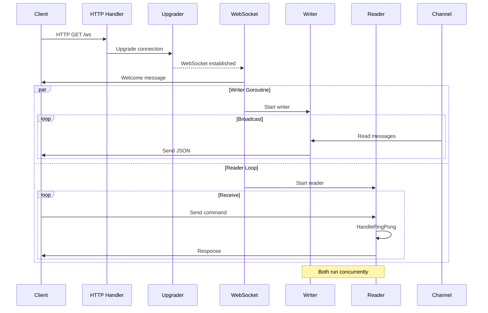
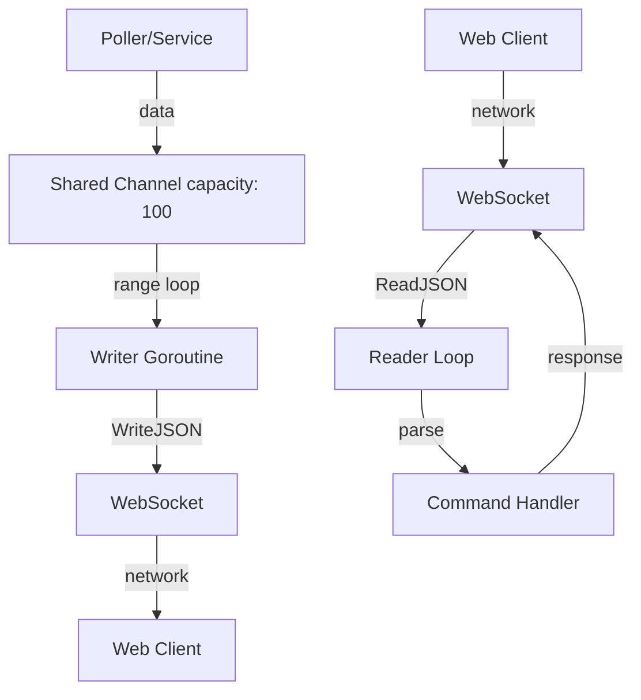

# WebSocket Package Documentation

## Overview

The `websocket` package provides real-time bidirectional communication between the Blitz server and clients. It handles connection management, message routing, ping/pong, and channel-based broadcasting.

---

## Package Information

- **Package**: `websocket`
- **Location**: `utils/websocket/`
- **Purpose**: Real-time client-server communication
- **Protocol**: WebSocket (RFC 6455)
- **Library**: `github.com/gorilla/websocket`

---

## Files Overview

| File          | Purpose                  | Key Functions                                           |
| ------------- | ------------------------ | ------------------------------------------------------- |
| `handler.go`  | Connection handling      | `Handle()`                                              |
| `websocke.go` | Connection utilities     | `CreateWebSocketConnection()`, `SendWebSocketMessage()` |
| `channel.go`  | Channel management       | `CreateChannel()`, `WriteChannelMessage()`              |
| `pingPong.go` | Ping/pong implementation | `HandlePingPong()`, `SendPong()`                        |

---

## Architecture

### Connection Flow



### Message Flow



---

## File: `handler.go`

Main WebSocket connection handler.

### Function: `Handle(res http.ResponseWriter, req *http.Request)`

**Description**: HTTP handler that upgrades connection to WebSocket and manages client communication.

**Parameters**:

- `res http.ResponseWriter` - HTTP response writer
- `req *http.Request` - HTTP request

**Flow**:

1. Upgrades HTTP connection to WebSocket
2. Sends welcome message
3. Starts writer goroutine (broadcasts to client)
4. Starts reader loop (receives from client)
5. Handles disconnection cleanup

**Implementation**:

```go
func Handle(res http.ResponseWriter, req *http.Request) {
    conn, err := CreateWebSocketConnection(res, req)
    if err != nil {
        http.Error(res, "Failed to upgrade connection", http.StatusInternalServerError)
        return
    }
    defer conn.Close()

    // Send welcome message
    msg := models.ServerResponse{
        Message: "Welcome to the WebSocket server!",
    }
    if err := SendWebSocketMessage(msg); err != nil {
        http.Error(res, "Failed to send welcome message", http.StatusInternalServerError)
        return
    }

    chh := GetChannel()
    if chh == nil {
        http.Error(res, "Failed to get response channel", http.StatusInternalServerError)
        return
    }

    // Writer goroutine - sends messages to client
    go func() {
        for response := range chh {
            if err := conn.WriteJSON(response); err != nil {
                break
            }
        }
    }()

    // Reader goroutine - receives messages from client
    for {
        var msg map[string]interface{}
        if err := conn.ReadJSON(&msg); err != nil {
            break
        }
        log.Printf("Received message: %+v\n", msg)

        // Handle ping/pong
        HandlePingPong(conn, msg)
    }
}
```

**Goroutines**:

#### Writer Goroutine

- **Purpose**: Broadcasts server messages to client
- **Source**: Reads from shared channel
- **Exit**: When channel closed or write error
- **Blocking**: Yes (range on channel)

#### Reader Loop

- **Purpose**: Receives and processes client messages
- **Exit**: When connection closed or read error
- **Blocking**: Yes (ReadJSON blocks)

---

## File: `websocke.go`

WebSocket connection utilities.

### Global Variables

```go
var upgrader = websocket.Upgrader{
    CheckOrigin: func(r *http.Request) bool {
        return true  // Allow all origins (⚠️ security consideration)
    }
}

var Conn *websocket.Conn  // Global connection (⚠️ supports single client)
```

---

### Function: `CreateWebSocketConnection(w http.ResponseWriter, r *http.Request) (*websocket.Conn, error)`

**Description**: Upgrades HTTP connection to WebSocket protocol.

**Parameters**:

- `w http.ResponseWriter` - Response writer
- `r *http.Request` - HTTP request

**Returns**:

- `*websocket.Conn` - WebSocket connection
- `error` - Error if upgrade fails

**Example**:

```go
conn, err := CreateWebSocketConnection(w, r)
if err != nil {
    log.Fatal("Upgrade failed:", err)
}
defer conn.Close()
```

**Configuration**:

- **CheckOrigin**: Returns `true` (allows all origins)
- **Note**: Global `Conn` variable is set (single client limitation)

---

### Function: `CloseWebSocketConnection()`

**Description**: Closes the global WebSocket connection.

**Behavior**:

- Checks if `Conn` is nil
- Closes connection if exists
- Logs success or error

**Example**:

```go
CloseWebSocketConnection()
```

---

### Function: `SendWebSocketMessage(msg models.ServerResponse) error`

**Description**: Sends a message directly through the global WebSocket connection.

**Parameters**:

- `msg models.ServerResponse` - Message to send

**Returns**:

- `error` - Error if send fails

**Example**:

```go
err := SendWebSocketMessage(models.ServerResponse{
    Status: "success",
    Message: "Hello",
    Data: map[string]string{"key": "value"},
})
```

**Note**: Uses global `Conn` variable (not channel-based).

---

### Function: `IsWebSocketConnected() bool`

**Description**: Checks if WebSocket connection is active.

**Returns**:

- `bool` - True if connected, false otherwise

**Example**:

```go
if IsWebSocketConnected() {
    SendWebSocketMessage(msg)
}
```

---

## File: `channel.go`

Thread-safe channel management for broadcasting messages.

### Global Variables

```go
var (
    sharedChannel chan models.ServerResponse
    once          sync.Once      // Ensures single initialization
    mu            sync.RWMutex   // Thread-safe access
)
```

---

### Function: `CreateChannel() chan models.ServerResponse`

**Description**: Creates shared channel (singleton pattern using sync.Once).

**Returns**: `chan models.ServerResponse` - Shared channel

**Capacity**: 100 (buffered)

**Thread Safety**: ✅ Yes (sync.Once)

**Implementation**:

```go
func CreateChannel() chan models.ServerResponse {
    once.Do(func() {
        sharedChannel = make(chan models.ServerResponse, 100)
        log.Println("Channel created successfully")
    })
    return sharedChannel
}
```

**Usage**:

```go
ch := CreateChannel()  // Safe to call multiple times
```

---

### Function: `GetChannel() chan models.ServerResponse`

**Description**: Gets or creates shared channel with mutex protection.

**Returns**: `chan models.ServerResponse` - Shared channel

**Thread Safety**: ✅ Yes (RWMutex)

**Implementation**:

```go
func GetChannel() chan models.ServerResponse {
    mu.Lock()
    defer mu.Unlock()
    if sharedChannel == nil {
        sharedChannel = make(chan models.ServerResponse)
        log.Println("Channel created inside GetChannel")
    } else {
        log.Println("Channel already exists, returning existing channel")
    }
    return sharedChannel
}
```

**Note**: Creates unbuffered channel if not exists (differs from `CreateChannel()`).

---

### Function: `CloseChannel()`

**Description**: Closes shared channel and sets to nil.

**Thread Safety**: ✅ Yes (RWMutex)

**Implementation**:

```go
func CloseChannel() {
    mu.Lock()
    defer mu.Unlock()
    if sharedChannel != nil {
        close(sharedChannel)
        sharedChannel = nil
        log.Println("Channel closed and set to nil")
    } else {
        log.Println("Channel is already nil, nothing to close")
    }
}
```

**Warning**: Closing channel will panic writer goroutines if they try to send.

---

### Function: `WriteChannelMessage(msg models.ServerResponse)`

**Description**: Sends message to shared channel (non-blocking).

**Parameters**:

- `msg models.ServerResponse` - Message to broadcast

**Behavior**:

- Sends to channel if available
- Drops message if channel full (non-blocking)
- Logs if channel is nil

**Implementation**:

```go
func WriteChannelMessage(msg models.ServerResponse) {
    if sharedChannel == nil {
        log.Println("Channel is nil, cannot send message")
        return
    }

    select {
    case sharedChannel <- msg:
        // Message sent successfully
    default:
        log.Println("Channel is full, message not sent:", msg)
    }
}
```

**Thread Safety**: ⚠️ Partially (no mutex, but channel operations are atomic)

---

## File: `pingPong.go`

Ping/pong command handling for connection health checks.

### Function: `HandlePingPong(conn *websocket.Conn, msg map[string]interface{})`

**Description**: Processes incoming messages and responds to ping commands.

**Parameters**:

- `conn *websocket.Conn` - WebSocket connection
- `msg map[string]interface{}` - Received message

**Behavior**:

- Checks if message has "command" field
- If command is "ping", sends pong response
- Ignores non-ping messages

**Example Message**:

```json
{
  "command": "ping"
}
```

**Implementation**:

```go
func HandlePingPong(conn *websocket.Conn, msg map[string]interface{}) {
    command, ok := msg["command"].(string)
    if !ok {
        return
    }

    if command == "ping" {
        SendPong(conn)
    }
}
```

---

### Function: `SendPong(conn *websocket.Conn)`

**Description**: Sends pong response with timestamp and server info.

**Parameters**:

- `conn *websocket.Conn` - WebSocket connection

**Response Format**:

```json
{
  "status": "success",
  "message": "pong",
  "data": {
    "timestamp": 1699999999,
    "server": "Blitz WebSocket"
  }
}
```

**Implementation**:

```go
func SendPong(conn *websocket.Conn) {
    response := models.ServerResponse{
        Status:  "success",
        Message: "pong",
        Data: map[string]interface{}{
            "timestamp": time.Now().Unix(),
            "server":    "Blitz WebSocket",
        },
    }

    if err := conn.WriteJSON(response); err != nil {
        log.Printf("❌ Failed to send pong: %v", err)
    } else {
        log.Println("🏓 Pong sent")
    }
}
```

---

## Message Protocol

### Client to Server

**Format**: JSON object with `command` field

**Examples**:

```json
// Ping
{"command": "ping"}

// Custom command (example)
{"command": "get_status"}
```

---

### Server to Client

**Format**: `models.ServerResponse`

```go
type ServerResponse struct {
    Status  string      `json:"status"`
    Message string      `json:"message"`
    Data    interface{} `json:"data"`
}
```

**Examples**:

#### Media Info

```json
{
  "status": "success",
  "message": "media_info",
  "data": {
    "title": "Song Title",
    "artist": "Artist Name",
    "album": "Album Name"
  }
}
```

#### Pong Response

```json
{
  "status": "success",
  "message": "pong",
  "data": {
    "timestamp": 1699999999,
    "server": "Blitz WebSocket"
  }
}
```

#### Welcome Message

```json
{
  "status": "",
  "message": "Welcome to the WebSocket server!",
  "data": null
}
```

---

## Client Integration

### JavaScript Example

<details>
<summary>💻 Click to see full client implementation</summary>

```javascript
const ws = new WebSocket("ws://localhost:8765/ws");

// Connection opened
ws.onopen = function (event) {
  console.log("Connected");

  // Send ping
  ws.send(JSON.stringify({ command: "ping" }));
};

// Receive messages
ws.onmessage = function (event) {
  const data = JSON.parse(event.data);
  console.log("Received:", data);

  if (data.message === "media_info") {
    updateUI(data.data);
  }
};

// Connection closed
ws.onclose = function (event) {
  console.log("Disconnected");
};

// Error
ws.onerror = function (error) {
  console.error("WebSocket error:", error);
};
```

</details>

---

## Security Considerations

### Current Issues ⚠️

1. **CORS**: `CheckOrigin` returns `true` (allows all origins)

   - **Risk**: Any website can connect to your WebSocket
   - **Fix**: Validate origin properly

2. **Single Client**: Global `Conn` variable supports only one client

   - **Risk**: Multiple clients will overwrite connection
   - **Fix**: Use connection pool or per-client handling

3. **No Authentication**: No auth check on connection

   - **Risk**: Anyone can connect
   - **Fix**: Add token-based authentication

4. **No Rate Limiting**: Unlimited messages accepted
   - **Risk**: DoS attacks
   - **Fix**: Implement rate limiting

---

### Recommended Improvements

#### 1. Origin Validation

```go
var upgrader = websocket.Upgrader{
    CheckOrigin: func(r *http.Request) bool {
        origin := r.Header.Get("Origin")
        return origin == "http://localhost:8765" ||
               origin == "http://127.0.0.1:8765"
    },
}
```

#### 2. Multiple Clients

```go
var clients = make(map[*websocket.Conn]bool)
var clientsMutex sync.RWMutex

// Add client
clientsMutex.Lock()
clients[conn] = true
clientsMutex.Unlock()

// Broadcast to all
for client := range clients {
    client.WriteJSON(msg)
}
```

#### 3. Authentication

```go
token := r.URL.Query().Get("token")
if !validateToken(token) {
    http.Error(w, "Unauthorized", http.StatusUnauthorized)
    return
}
```

---

## Performance

### Benchmarks (Estimated)

| Metric                | Value        |
| --------------------- | ------------ |
| Max Messages/sec      | ~10,000      |
| Latency (local)       | < 1ms        |
| Memory per connection | ~4 KB        |
| Channel buffer        | 100 messages |

### Bottlenecks

1. **Channel Buffer**: Full channel drops messages
2. **Single Connection**: Global `Conn` limits scalability
3. **JSON Marshaling**: Slower than binary protocols

---

## Error Handling

### Connection Errors

```go
if err := conn.ReadJSON(&msg); err != nil {
    // Client disconnected or network error
    log.Println("Read error:", err)
    break  // Exit reader loop
}
```

### Write Errors

```go
if err := conn.WriteJSON(response); err != nil {
    // Send failed (client disconnected)
    log.Println("Write error:", err)
    break  // Exit writer goroutine
}
```

### Channel Errors

```go
if sharedChannel == nil {
    log.Println("Channel is nil")
    return
}
```

---

## Testing

### Manual Testing

Use the web client at `http://127.0.0.1:8765/`:

1. Click "Connect" button
2. Click "Send Ping" button
3. Check console for messages
4. Observe media info updates every second

### Unit Test Example

```go
func TestPingPong(t *testing.T) {
    server := httptest.NewServer(http.HandlerFunc(Handle))
    defer server.Close()

    wsURL := "ws" + strings.TrimPrefix(server.URL, "http") + "/ws"
    ws, _, err := websocket.DefaultDialer.Dial(wsURL, nil)
    if err != nil {
        t.Fatal(err)
    }
    defer ws.Close()

    // Send ping
    ws.WriteJSON(map[string]string{"command": "ping"})

    // Receive pong
    var response models.ServerResponse
    ws.ReadJSON(&response)

    if response.Message != "pong" {
        t.Errorf("Expected pong, got %s", response.Message)
    }
}
```

---

## Common Issues

### Issue 1: Connection Refused

**Error**: `dial tcp :8765: connect: connection refused`

**Cause**: Server not running

**Solution**: Start server with `go run main.go`

---

### Issue 2: Messages Not Received

**Cause**: Writer goroutine not started or channel not being read

**Solution**: Ensure `Handle()` starts writer goroutine and reads channel

---

### Issue 3: Connection Closes Immediately

**Cause**: Reader loop exits due to error

**Solution**: Check client is sending valid JSON

---

### Issue 4: Multiple Clients Not Working

**Cause**: Global `Conn` variable

**Solution**: Refactor to support multiple connections

---

## Future Enhancements

- [ ] Support multiple simultaneous clients
- [ ] Add authentication (JWT tokens)
- [ ] Implement proper origin validation
- [ ] Add rate limiting per client
- [ ] Support binary messages (Protocol Buffers)
- [ ] Add compression (permessage-deflate)
- [ ] Implement heartbeat/keepalive
- [ ] Add reconnection logic on client
- [ ] Support message acknowledgments
- [ ] Add metrics (connections, messages, errors)

---

## Related Documentation

- [Poller Documentation](./POLLER.md)
- [Main Application](./MAIN.md)
- [Project Structure](../PROJECT_STRUCTURE.md)

---

**Last Updated**: November 14, 2025  
**Version**: 1.0.0
